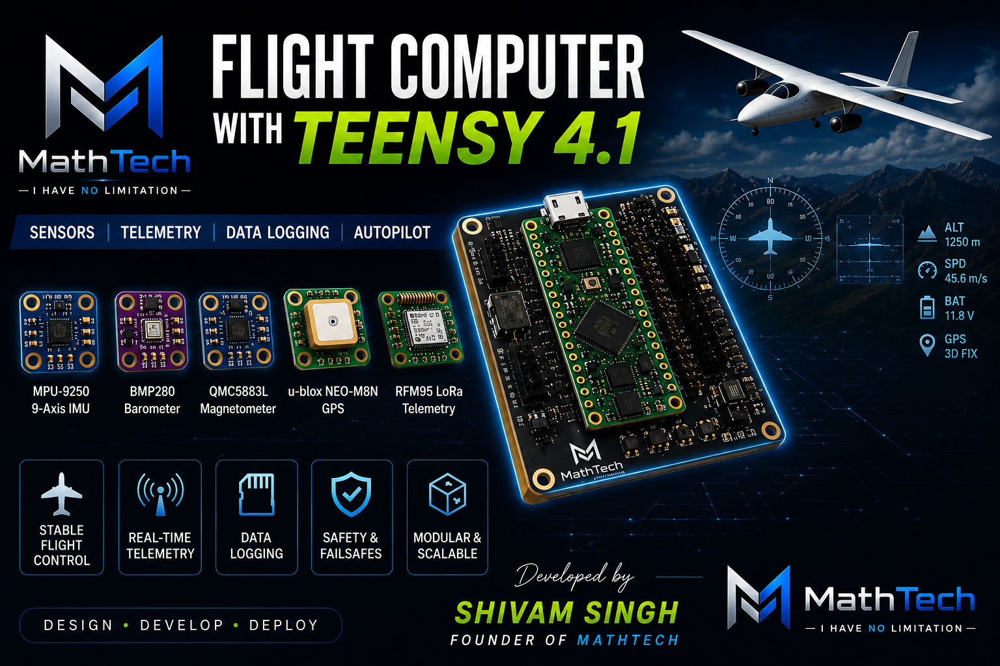

# 🚀 Teensy 4.1 Flight Controller Module



<div align="center">

# ✈️ Advanced Aerospace Flight Computer

### Developed by Shivam Singh

### Founder of MathTech

Advanced embedded aerospace flight controller system using Teensy 4.1 for UAVs, autonomous drones, telemetry systems, and aerospace research.

</div>

---

# 📌 Overview

The **Teensy 4.1 Flight Controller Module** is a high-performance aerospace embedded system designed for:

- Autonomous UAV Systems
- Rocket Flight Computers
- Drone Stabilization
- Aerospace Telemetry
- Real-Time Sensor Fusion
- Educational Aerospace Research
- Robotics Navigation

This project combines multiple sensors, telemetry communication, SD logging, and PID stabilization into a professional modular firmware architecture.

---

# 🔥 Features

## ✅ Flight Stabilization

- PID-Based Flight Control
- Roll Stabilization
- Pitch Stabilization
- Yaw Stabilization
- Real-Time Orientation Tracking

---

## ✅ Sensor Fusion

- IMU Processing
- Altitude Estimation
- GPS Position Tracking
- Magnetometer Heading
- Real-Time Sensor Updates

---

## ✅ Telemetry Communication

- Long Range LoRa Telemetry
- Real-Time Flight Data
- Ground Station Compatible
- Wireless Monitoring

---

## ✅ Data Logging

- microSD Card Logging
- CSV Telemetry Storage
- Flight History Recording
- Sensor Backup System

---

## ✅ Aerospace Architecture

- Modular Firmware Design
- High-Speed Embedded Processing
- Real-Time Task Scheduling
- Scalable Driver Architecture

---

# 🧠 System Architecture

```text
                  +----------------------+
                  |    Teensy 4.1 MCU    |
                  +----------+-----------+
                             |
     ---------------------------------------------------
     |            |             |           |          |
   MPU9250      BMP280       GPS NEO     LoRa      SD Card
     |            |             |           |          |
     ---------------------------------------------------
                             |
                     Flight Controller
                             |
                       PID Stabilizer
                             |
                        Servo Outputs
```

---

# 🛠 Hardware Components

| Component         | Model      |
| ----------------- | ---------- |
| Flight Controller | Teensy 4.1 |
| IMU Sensor        | MPU9250    |
| Barometer         | BMP280     |
| Magnetometer      | QMC5883L   |
| GPS Module        | NEO-M8N    |
| Telemetry         | RFM95 LoRa |
| Storage           | microSD    |
| Power Module      | MP1584EN   |

---

# 🔌 Pin Connections

## MPU9250 IMU

| MPU9250 | Teensy 4.1 |
| ------- | ---------- |
| VCC     | 3.3V       |
| GND     | GND        |
| SDA     | Pin 18     |
| SCL     | Pin 19     |

---

## BMP280 Barometer

| BMP280 | Teensy 4.1 |
| ------ | ---------- |
| VCC    | 3.3V       |
| GND    | GND        |
| SDA    | Pin 18     |
| SCL    | Pin 19     |

---

## GPS NEO-M8N

| GPS | Teensy |
| --- | ------ |
| TX  | RX1    |
| RX  | TX1    |
| VCC | 3.3V   |
| GND | GND    |

---

## LoRa RFM95

| LoRa | Teensy |
| ---- | ------ |
| MISO | 12     |
| MOSI | 11     |
| SCK  | 13     |
| NSS  | 10     |
| RST  | 9      |
| DIO0 | 2      |

---

# 📂 Project Structure

```text
flight-controller-teensy-module/
│
├── src/
│   ├── main.cpp
│   ├── config.h
│   │
│   ├── sensors/
│   │   ├── imu.cpp
│   │   ├── imu.h
│   │   ├── gps.cpp
│   │   ├── gps.h
│   │   ├── barometer.cpp
│   │   ├── barometer.h
│   │   ├── magnetometer.cpp
│   │   └── magnetometer.h
│   │
│   ├── flight/
│   │   ├── pid.cpp
│   │   ├── pid.h
│   │   ├── flight_controller.cpp
│   │   └── flight_controller.h
│   │
│   ├── telemetry/
│   │   ├── lora.cpp
│   │   └── lora.h
│   │
│   ├── logging/
│   │   ├── sd_logger.cpp
│   │   └── sd_logger.h
│   │
│   └── utils/
│       ├── battery.cpp
│       └── battery.h
│
├── include/
├── lib/
├── docs/
├── assets/
├── README.md
└── platformio.ini
```

---

# ⚙️ Installation

## Clone Repository

```bash
git clone https://github.com/ShivamMathtech/flight-controller-teensy-module.git
```

---

## Build Firmware

```bash
pio run
```

---

## Upload Firmware

```bash
pio run --target upload
```

---

# 📦 Required Libraries

```ini
lib_deps =
    adafruit/Adafruit BMP280 Library
    bolderflight/MPU9250
    mikalhart/TinyGPSPlus
    sandeepmistry/LoRa
```

---

# 📈 Real-Time Tasks

| Task       | Frequency |
| ---------- | --------- |
| IMU Update | 400 Hz    |
| PID Loop   | 400 Hz    |
| GPS Update | 10 Hz     |
| Telemetry  | 20 Hz     |
| SD Logging | 50 Hz     |

---

# 🛡 Safety Features

- Watchdog Timer
- Sensor Validation
- Battery Monitoring
- GPS Signal Loss Handling
- Emergency Recovery Mode
- CRC Packet Verification
- SD Backup Logging
- Failsafe Flight Recovery

---

# 🔬 Future Improvements

- Extended Kalman Filter
- Autonomous Navigation
- MAVLink Support
- ROS2 Integration
- AI Flight Prediction
- Terrain Avoidance
- Swarm Communication
- Computer Vision Navigation

---

# 👨‍💻 Developed By

# Shivam Si
